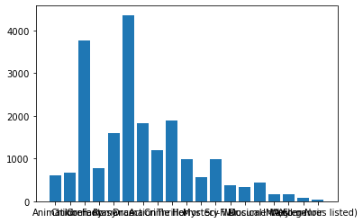
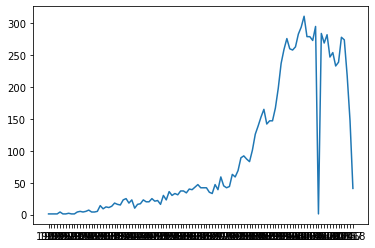
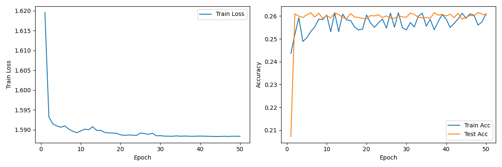
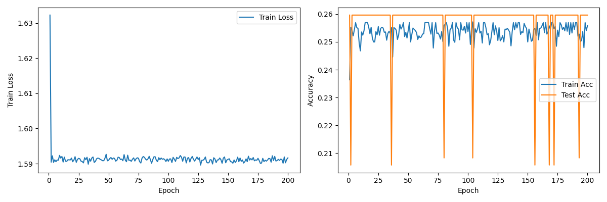
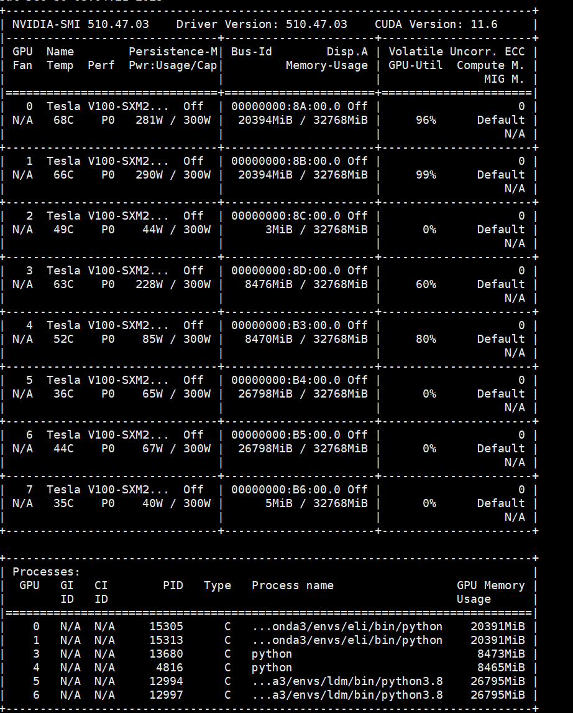
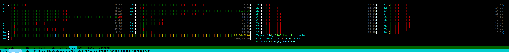
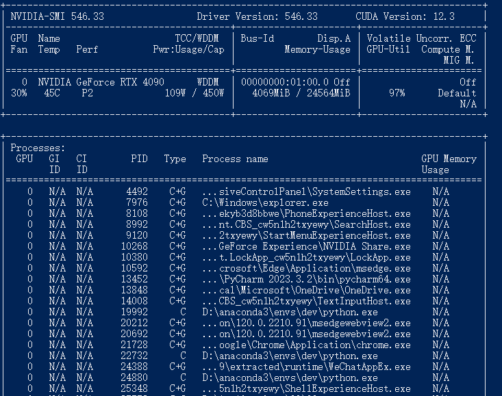

# Movie Rate Classification Report
## 1. 实验概述
### 1.1 实验名称
电影星级预测
### 1.2 实验目的
帮助学生深入理解深度学习的基本理论和概念， 通过实验，学生可以学习并掌握流行的深度学习框架（如TensorFlow、PyTorch等）和工具。这包括如何构建、训练和评估深度学习模型，以及如何利用这些工具解决实际问题。训练深度学习模型，完成根据电影属性，预测电影星级评分的任务。
### 1.3 实验环境
+ python环境
  + python=3.10
  + pytorch=2.1.2
  + 详见requirements.txt
+ 硬件环境
  + 本地环境：
    + CPU：13th Gen Intel(R) Core(TM) i7-13700KF   3.40 GHz
    + 内存：32.0 GB (31.8 GB 可用)
    + GPU：GeForce RTX 4090
  + 服务器环境：
    + CPU：Intel(R) Xeon(R)
    + 内存：502G
    + GPU：V100
### 1.4 实验内容
将9742部电影随机划分训练集（data_train）与验证集（data_val）
使用训练集训练模型，预测验证集电影的标签

重复三次“训练集/验证集划分、训练、测试”，汇报三次的平均准确率
### 1.5 项目结构
```
ProjectRoot/
    data/
        input/ # 从kaggle上面下载下来的数据
        data_processing.ipynb # 数据处理脚本
        data.csv # 处理后的数据，后续训练模型都使用此数据
    Net/
        AutoFCnet.py # 第一个网络
        data_utils.py # 数据读取和处理的相关函数和类封装
        FC_nomal_train.py # 对全连接网络尝试普通训练
        find_FC.py # 对第一个网络进行暴力调参
        find_RNN.py # 对第二个网络调参
        model_utils.py # 和模型训练、测试相关的函数
        RNN.py # 第二个网络
        RNN_normal_train.py # 对RNN尝试普通训练
    RandomForest/
        data_utils.py # 数据读取和处理相关的函数和类封装
        highest.py # 最高准确率对应参数
        random_forest_classifier.py # 对随机森林分类器的调参尝试
        random_forest_regressor.py # 对随机森林回归的调参尝试
    requirements.txt # 项目环境冻结
```

## 2. 实验总体设计
1. 数据读取
2. 数据探索&处理
3. 建模
4. 调参

## 3. 实验过程
### 3.1 数据读取
从kaggle上下载下来的数据总共有4个csv文件，其中links是相关电影对应的网址链接的具体id号，movies就是电影ID和电影名称的对应关系，并且还有电影的genres
ratings里面就是每部电影的评分，tags则是每部电影的标签。其中，和任务关系最紧密的就是movies.csv和ratings.csv。

关于links,曾经尝试过使用selenium，通过模拟浏览器的方式来从网站上获取相关的信息，但是发现过于复杂而且有用信息不多。
更关键的是担心从网站上提取的信息不仅无效，甚至干扰后续的训练和预测，因此放弃对该数据的使用。

对于tags，观察后发现其中的标签并没有一个明确的集合，无法对其进行量化，因此也不是特别具有参考价值。

### 3.2 数据探索&处理
为了能够将数据量化来训练，并且在处理数据的时候比较易于观看，使用jupyter notebook来处理数据。

其中，在电影的名字中包含着电影的年份， 可以作为电影的特性之一，通过正则表达式的方式提取出来。而根据处理发现，电影总共有20个genres，为了方便训练，
将这20个genres制作成01表格的形式来处理。最后，电影的评分很明显是平均数，在做回归的时候可以直接使用，但是在做五分类的时候必须要进行相应的处理。
但是为了数据的完整性，在生成data.csv的时候并不消除ratings小数点后的任何内容。

```python
movie = pd.read_csv("input/movies.csv")
ratings = pd.read_csv("input/ratings.csv")
links = pd.read_csv("input/links.csv")
tags = pd.read_csv("input/tags.csv")
#take a look at the training data
print(movie.shape)
print(ratings.shape)
print(links.shape)
print(tags.shape,end="\n\n")
m=pd.read_csv("input/movies.csv")
movie.head(3)
links.head(3)
ratings.head(3)
tags.head(3)

#get a list of the features within the dataset
print("Movie : ", movie.columns,end="\n\n")
print("Rating : ", ratings.columns,end="\n\n")
print("Links : ", links.columns,end="\n\n")
print("Tags : ", tags.columns,end="\n\n")

movie.info()
ratings.info()
tags.info()
```
输出
```
(9742, 3)
(100836, 4)
(9742, 3)
(3683, 4)

Movie :  Index(['movieId', 'title', 'genres'], dtype='object')

Rating :  Index(['userId', 'movieId', 'rating', 'timestamp'], dtype='object')

Links :  Index(['movieId', 'imdbId', 'tmdbId'], dtype='object')

Tags :  Index(['userId', 'movieId', 'tag', 'timestamp'], dtype='object')

<class 'pandas.core.frame.DataFrame'>
RangeIndex: 9742 entries, 0 to 9741
Data columns (total 3 columns):
 #   Column   Non-Null Count  Dtype 
---  ------   --------------  ----- 
 0   movieId  9742 non-null   int64 
 1   title    9742 non-null   object
 2   genres   9742 non-null   object
dtypes: int64(1), object(2)
memory usage: 228.5+ KB
<class 'pandas.core.frame.DataFrame'>
RangeIndex: 100836 entries, 0 to 100835
Data columns (total 4 columns):
 #   Column     Non-Null Count   Dtype  
---  ------     --------------   -----  
 0   userId     100836 non-null  int64  
 1   movieId    100836 non-null  int64  
 2   rating     100836 non-null  float64
 3   timestamp  100836 non-null  int64  
dtypes: float64(1), int64(3)
memory usage: 3.1 MB
<class 'pandas.core.frame.DataFrame'>
RangeIndex: 3683 entries, 0 to 3682
Data columns (total 4 columns):
 #   Column     Non-Null Count  Dtype 
---  ------     --------------  ----- 
 0   userId     3683 non-null   int64 
 1   movieId    3683 non-null   int64 
 2   tag        3683 non-null   object
 3   timestamp  3683 non-null   int64 
dtypes: int64(3), object(1)
memory usage: 115.2+ KB
```
分析数据



### 3.3 建模
#### 3.3.1 训练前准备
为了后续在训练模型的时候方便，先提前将训练和测试函数封装好。
```python
import torch


def train_net(model, train_loader, optimizer, criterion, device):
    model.train()
    train_loss = 0
    train_correct = 0
    train_total = 0
    for inputs, labels in train_loader:
        inputs, labels = inputs.to(device), labels.to(device)
        optimizer.zero_grad()
        outputs = model(inputs)
        loss = criterion(outputs, labels)
        loss.backward()
        optimizer.step()
        train_loss += loss.item() * inputs.size(0)
        _, predicted = torch.max(outputs.data, dim=1)
        train_total += labels.size(0)
        train_correct += (predicted == labels).sum().item()
    train_loss /= train_total
    train_acc = train_correct / train_total
    return train_loss, train_acc


def test_net(model, test_loader, device):
    model.eval()
    test_correct = 0
    test_total = 0
    with torch.no_grad():
        for inputs, labels in test_loader:
            inputs, labels = inputs.to(device), labels.to(device)
            outputs = model(inputs)
            _, predicted = torch.max(outputs.data, dim=1)
            test_total += labels.size(0)
            test_correct += (predicted == labels).sum().item()
        test_acc = test_correct / test_total
        return test_acc

```
以上函数的封装可以使用与所有的模型，因此后续的“模型训练“即指代使用上面的代码训练模型，train_acc和test_acc都是通过以上函数得到。
当然，为了读取数据方便，也将数据读取封装成了函数，将会返回对应的dataloader。
```python
import pandas as pd 
import numpy as np
from sklearn.model_selection import train_test_split
import torch
from torch.utils.data import TensorDataset, DataLoader

def load_data(batch_size):
    movie = pd.read_csv("../data/data.csv")
    movie['rating'] = pd.qcut(movie['rating'], q=5, labels=False, duplicates='drop')
    X = movie[movie.columns[3:23]]
    y = movie[movie.columns[-1]]
    X_train, X_test, y_train, y_test = train_test_split(X, y, test_size=0.20, random_state=2, shuffle=True)
    X_train, X_test, y_train, y_test = np.array(X_train), np.array(X_test), np.array(y_train), np.array(y_test)
    X_train = torch.from_numpy(X_train.astype(np.float32))
    y_train = torch.from_numpy(y_train.astype(np.int64))
    X_test = torch.from_numpy(X_test.astype(np.float32))
    y_test = torch.from_numpy(y_test.astype(np.int64))

    # Create DataLoader
    train_dataset = TensorDataset(X_train, y_train)
    test_dataset = TensorDataset(X_test, y_test)

    train_loader = DataLoader(train_dataset, batch_size=batch_size, shuffle=True)
    test_loader = DataLoader(test_dataset, batch_size=batch_size, shuffle=False)
    return X_train, train_loader, test_loader
```
这样当每次训练模型的时候只要调用以上三个函数就可以完成训练前的准备了。真正的训练的时候只需要在每个epoch里面调用train_net和test_net函数就可以。

### 3.3.2 神经网络
神经网络由多个相互连接的节点（神经元）组成，这些节点通过权重来传递信息。神经网络通常分为三层：输入层、隐藏层和输出层。

1. **输入层（Input Layer）：** 接受原始数据的层，每个节点代表输入特征。

2. **隐藏层（Hidden Layer）：** 位于输入层和输出层之间，负责处理输入数据并提取特征。一个神经网络可以有多个隐藏层，每个隐藏层可以包含多个神经元。

3. **输出层（Output Layer）：** 生成最终的预测或输出结果。输出层的节点数通常取决于任务的性质，例如二分类问题有一个节点，多分类问题有多个节点。

连接每一对节点的边都有一个相关的权重，这些权重用于调整输入信号的影响。神经网络使用激活函数来引入非线性性，允许网络学习复杂的关系和模式。

训练神经网络的过程通常包括以下步骤：

1. **前向传播（Forward Propagation）：** 输入数据通过网络，通过权重和激活函数计算输出。

2. **损失函数计算（Loss Calculation）：** 计算模型的预测与实际标签之间的差距。

3. **反向传播（Backward Propagation）：** 通过梯度下降等优化算法，调整权重以最小化损失函数。

4. **参数更新：** 使用反向传播得到的梯度信息更新网络中的权重。

这个训练过程迭代进行，直到达到满意的性能水平。

### 3.3.3 基于全连接的神经网络构建
由于每条电影数据都只能看作一个序列，无法使用卷积，因此首先考虑使用全连接层来进行训练和预测。
```python
from torch import nn
class simpleNet(nn.Module):
    def __init__(self, in_dim, n_hidden_1, n_hidden_2, out_dim):
        super(simpleNet, self).__init__()
        self.layer1 = nn.Linear(in_dim, n_hidden_1)
        self.layer2 = nn.Linear(n_hidden_1, n_hidden_2)
        self.layer3 = nn.Linear(n_hidden_2, out_dim)

    def forward(self, x):
        x = self.layer1(x)
        x = self.layer2(x)
        x = self.layer3(x)
        return x
```
首先定义了一个最简单的三层的全连接神经网络，来尝试对其进行基础的train和test。发现对于三层的网络，无论是调整hidden_dim还是增加训练次数或者修改学习率，
test_acc都只能在0.25~0.26之间，因此尝试增加网络层数，并且加入激活函数。
```python
from torch import nn 
class Activation_Net(nn.Module):
    def __init__(self, in_dim, n_hidden_1, n_hidden_2, out_dim):
        super(Activation_Net, self).__init__()
        self.layer1 = nn.Sequential(nn.Linear(in_dim, n_hidden_1), nn.ReLU(True))
        self.layer2 = nn.Sequential(nn.Linear(48, 196), nn.ReLU(True))
        self.layer21 = nn.Sequential(nn.Linear(196, 256), nn.ReLU(True))
        self.layer22 = nn.Sequential(nn.Linear(256, 512), nn.ReLU(True))
        self.layer23 = nn.Sequential(nn.Linear(512, 1024), nn.ReLU(True))
        self.layer24 = nn.Sequential(nn.Linear(1024, 1024), nn.ReLU(True))
        self.layer25 = nn.Sequential(nn.Linear(1024, 512), nn.ReLU(True))
        self.layer26 = nn.Sequential(nn.Linear(512, 256), nn.ReLU(True))
        self.layer27 = nn.Sequential(nn.Linear(256, 128), nn.ReLU(True))
        self.layer28 = nn.Sequential(nn.Linear(128, 64), nn.ReLU(True))
        self.layer29 = nn.Sequential(nn.Linear(64, 32), nn.ReLU(True))
        self.layer3 = nn.Sequential(nn.Linear(32, out_dim))

    def forward(self, x):
        x = self.layer1(x)
        x = self.layer2(x)
        x = self.layer21(x)
        x = self.layer22(x)
        x = self.layer23(x)
        x = self.layer24(x)
        x = self.layer25(x)
        x = self.layer26(x)
        x = self.layer27(x)
        x = self.layer28(x)
        x = self.layer29(x)
        x = self.layer3(x)
        return x
```
发现增加了层数以后，模型的准确率将有小数点后第三位的提升，但是可以说效果非常不明显，对于五分类任务只能达到0.26的准确率。

在发现了以上实验结果以后，对于神经网络有了比较大的不确定了，因此只能尝试通过暴力的方法搜索有没有效果比较好的参数。

为了能够变化地生成不同的神经网络，重新写了一个神经网络，其中的`__init__`能够根据输入，构建不同层次的神经网络。
```python
from torch import nn

class AutoFCNet(nn.Module):
    def __init__(self, input_size, num_classes, hidden_sizes):
        super(AutoFCNet, self).__init__()
        self.layers = nn.ModuleList()
        last_size = input_size
        for size in hidden_sizes:
            self.layers.append(nn.Linear(last_size, size))
            self.layers.append(nn.ReLU())
            last_size = size
        # output
        self.layers.append(nn.Linear(last_size, num_classes))

    def forward(self, x):
        for layer in self.layers:
            x = layer(x)
        return x
```
如上所示，`AutoFCNet`可以根据传入的`hidden_sizes`来动态的构建网络的层数和具体层之间的`in_features`与`out_features`，来最大化的增加网络的可动性。

实现了以上网络之后，首先尝试普通训练。
```python
import torch.optim as optim
from torch import nn
import torch
from AutoFCnet import AutoFCNet
from data_utils import load_data, generate_combinations, NewThread
from model_utils import train_net, test_net
import matplotlib.pyplot as plt


def main():
    X_train, train_loader, test_loader = load_data(32)
    input_size = X_train.shape[1]
    num_classes = 5

    model = AutoFCNet(input_size, num_classes, [32,64,128,128,32])
    device = torch.device("cuda" if torch.cuda.is_available() else "cpu")
    criterion = nn.CrossEntropyLoss()
    optimizer = optim.Adam(model.parameters(), lr=1e-3)
    model.to(device)

    num_epochs = 200
    train_losses = []
    train_accs = []
    test_accs = []

    for epoch in range(num_epochs):
        train_loss, train_acc = train_net(model, train_loader, optimizer, criterion, device)
        test_acc = test_net(model, test_loader, device)

        train_losses.append(train_loss)
        train_accs.append(train_acc)
        test_accs.append(test_acc)

        print(
            f'Epoch [{epoch + 1}/{num_epochs}], Train Loss: {train_loss:.4f}, Train Acc: {train_acc:.4f}, Test Acc: {test_acc:.4f}')

    # 绘制图表
    plt.figure(figsize=(12, 4))

    # 绘制训练损失曲线
    plt.subplot(1, 2, 1)
    plt.plot(range(1, num_epochs + 1), train_losses, label='Train Loss')
    plt.xlabel('Epoch')
    plt.ylabel('Train Loss')
    plt.legend()

    # 绘制训练准确率和测试准确率曲线
    plt.subplot(1, 2, 2)
    plt.plot(range(1, num_epochs + 1), train_accs, label='Train Acc')
    plt.plot(range(1, num_epochs + 1), test_accs, label='Test Acc')
    plt.xlabel('Epoch')
    plt.ylabel('Accuracy')
    plt.legend()

    plt.tight_layout()
    plt.show()


if __name__ == '__main__':
    main()

```

普通训练的效果如下:



可以看到，对于以上网络，仅仅在45轮以后就开始出现过拟合状况了，但是训练的损失率却完全降落不下去。

接下来就要尝试寻找对于此数据效果比较好的参数了。

由于每条数据只有20个特征，因此第一层都不应该过大，所以尝试过的组合都在32~40左右，数据量也不是特别大，因此其实不论是对显存还是对内存压力都不会很大。

综上考虑，为了防止网络没有意义的过于复杂，限定网络层数不超过20层，为了提高训练速度，开启多线程训练。

但是为了能够方便的获得线程中函数的返回值，重写`threading.Thread`类。
```python
from threading import Thread 
class NewThread(Thread):
    def __init__(self, group=None, target=None, name=None,
                 args=(), kwargs={}):
        Thread.__init__(self, group, target, name, args, kwargs)
    def run(self):
        if self._target != None:
            self._return = self._target(*self._args, **self._kwargs)
    def join(self, *args):
        Thread.join(self, *args)
        return self._return

```
这样，在结束线程的时候也会能够返回线程函数的返回值。

接下来，实现具体代码来寻找最佳效果的参数组合。
```python
import torch
import torch.nn as nn
import torch.optim as optim
from AutoFCnet import AutoFCNet
from model_utils import train_net, test_net
from data_utils import load_data, generate_combinations, NewThread


def train_test(lr, batch_size, num_epochs, hidden_sizes):
    print(f'*******params:({lr},{batch_size},{num_epochs},{hidden_sizes})*********')
    best_test_acc = 0
    X_train, train_loader, test_loader = load_data(batch_size)
    input_size = X_train.shape[1]
    num_classes = 5

    model = AutoFCNet(input_size, num_classes, hidden_sizes)
    device = torch.device("cuda" if torch.cuda.is_available() else "cpu")
    criterion = nn.CrossEntropyLoss()
    optimizer = optim.Adam(model.parameters(), lr=lr)
    model.to(device)

    for epoch in range(num_epochs):
        train_loss, train_acc = train_net(model, train_loader, optimizer, criterion, device)
        test_acc = test_net(model, test_loader, device)
        best_test_acc = max(test_acc, best_test_acc)
        if epoch % 100 == 0 or epoch == num_epochs - 1:
            print(f'Epoch: {epoch},\t train_loss: {train_loss:.4f},\ttrain_acc: {train_acc},\ttest_acc: {test_acc}')

    return best_test_acc


def search_parameters(params):
    lr, batch_size, num_epochs, hidden_sizes = params
    return train_test(lr, batch_size, num_epochs, hidden_sizes)


def main():
    lr = [0.1, 0.0001, 1e-4, 1e-5]
    batch_size = [2, 32, 64, 128, 256, 1024]
    num_epochs = [20, 100, 200, 500]
    hidden_sizes = [
        [32, 64],
        [40,80,40],
        [40, 80, 160, 80, 40],
        [32, 64, 128, 128, 32],
        # [32, 64, 128, 256, 512, 1024, 1024, 512, 256, 128, 64, 32],
        # [32, 64, 128, 256, 256, 256, 256, 128, 64, 32]
    ]
    combinations = generate_combinations(lr, batch_size, num_epochs, hidden_sizes)
    best_acc = 0
    num_thread = 8
    for i in range(0, len(combinations), num_thread):
        threads = [NewThread(target=search_parameters, args=(params,)) for params in combinations[i:i + num_thread]]
        for thread in threads:
            thread.start()
        for thread in threads:
            test_acc = thread.join()
            best_acc = max(best_acc, test_acc)

    print(f'best_acc:{best_acc}')


if __name__ == '__main__':
    main()

```

训练中输出如下：
```
*******params:(0.1,2,20,[32, 64])*********
*******params:(0.1,2,20,[40, 80, 40])*********
*******params:(0.1,2,20,[40, 80, 160, 80, 40])*********
*******params:(0.1,2,20,[32, 64, 128, 128, 32])*********
*******params:(0.1,2,100,[32, 64])*********
*******params:(0.1,2,100,[40, 80, 40])*********
Epoch 1, Loss: 1.5855, train_acc: 0.2310	Test Accuracy: 0.2565418163160595
Epoch 20, Loss: 1.5907, train_acc: 0.2569	Test Accuracy: 0.25448948178553105
Epoch 100, Loss: 1.5611, train_acc: 0.2572	Test Accuracy: 0.2565418163160595
Epoch 100, Loss: 1.5483, train_acc: 0.2572	Test Accuracy: 0.2565418163160595
Epoch 100, Loss: 1.6098, train_acc: 0.2572	Test Accuracy: 0.2565418163160595
Epoch 200, Loss: 1.5971, train_acc: 0.2572	Test Accuracy: 0.2565418163160595
Epoch 200, Loss: 1.5971, train_acc: 0.2572	Test Accuracy: 0.2565418163160595
...
```

**结果分析**

不论如何寻找参数的最佳组合，最好的`test_acc`只能达到0.26左右，效果不够理想。

### 3.3.3 RNN
根据查询得知，RNN对于此类型的数据也可能比较有效，因此也尝试对此数据运用RNN。

RNN的构建如下：
```python
from torch import nn
class RNNModel(nn.Module):
    def __init__(self, input_size, hidden_size, output_size):
        super(RNNModel, self).__init__()
        self.rnn = nn.RNN(input_size, hidden_size, batch_first=True)
        self.fc = nn.Linear(hidden_size, output_size)

    def forward(self, x):
        out, _ = self.rnn(x)

        # If the RNN layer returns a sequence of hidden states
        if len(out.shape) == 3:
            out = self.fc(out[:, -1, :])
        # If the RNN layer returns a single hidden state
        else:
            out = self.fc(out)
        return out

```

首先尝试对RNN进行普通的训练：

```python
from RNN import RNNModel
from model_utils import train_net, test_net
from data_utils import load_data
from torch import nn
import torch.optim as optim
import torch
import matplotlib.pyplot as plt


def main():
    X_train, train_loader, test_loader = load_data(32)
    in_dim = X_train.shape[1]
    out_dim = 5
    model = RNNModel(in_dim, 32, out_dim)
    criterion = nn.CrossEntropyLoss()
    optimizer = optim.Adam(model.parameters(), lr=1e-3)
    device = torch.device('cuda' if torch.cuda.is_available() else 'cpu')
    model.to(device)

    num_epochs = 200
    train_losses = []
    train_accs = []
    test_accs = []

    for epoch in range(num_epochs):
        train_loss, train_acc = train_net(model, train_loader, optimizer, criterion, device)
        test_acc = test_net(model, test_loader, device)

        train_losses.append(train_loss)
        train_accs.append(train_acc)
        test_accs.append(test_acc)

        print(
            f'Epoch [{epoch + 1}/{num_epochs}], Train Loss: {train_loss:.4f}, Train Acc: {train_acc:.4f}, Test Acc: {test_acc:.4f}')

    # 绘制图表
    plt.figure(figsize=(12, 4))

    # 绘制训练损失曲线
    plt.subplot(1, 2, 1)
    plt.plot(range(1, num_epochs + 1), train_losses, label='Train Loss')
    plt.xlabel('Epoch')
    plt.ylabel('Train Loss')
    plt.legend()

    # 绘制训练准确率和测试准确率曲线
    plt.subplot(1, 2, 2)
    plt.plot(range(1, num_epochs + 1), train_accs, label='Train Acc')
    plt.plot(range(1, num_epochs + 1), test_accs, label='Test Acc')
    plt.xlabel('Epoch')
    plt.ylabel('Accuracy')
    plt.legend()

    plt.tight_layout()
    plt.show()


if __name__ == '__main__':
    main()

```

得到的训练结果如下图所示：



由于精度问题，可以看到`test_acc`在大部分情况下几乎没有变化，而且损失率也一直难以下降。

再把RNN运用到寻找参数的函数上面，因为RNN不再可以修改层数，因此只能尝试修改RNN的`hidden_size`。同时还调整`batch_size`,`learning_rate`,
`num_epoch`寻找最优组合。
```python
from RNN import RNNModel
import torch.optim as optim
from torch import nn
import torch
from data_utils import load_data, generate_combinations, NewThread
from model_utils import train_net, test_net


def train_test(lr, hidden_dim, batch_size, num_epochs):
    print(f'*******params:({lr},{hidden_dim},{batch_size},{num_epochs})*********')
    best_test_acc = 0
    X_train, train_loader, test_loader = load_data(batch_size)
    in_dim = X_train.shape[1]
    out_dim = 5

    model = RNNModel(in_dim, hidden_dim, out_dim)
    criterion = nn.CrossEntropyLoss()
    optimizer = optim.Adam(model.parameters(), lr=lr)

    device = torch.device('cuda' if torch.cuda.is_available() else 'cpu')
    model.to(device)

    for epoch in range(num_epochs):
        train_loss, train_acc = train_net(model, train_loader, optimizer, criterion, device)
        test_acc = test_net(model, test_loader, device)
        best_test_acc = max(test_acc, best_test_acc)
        if epoch % 100 == 0 or epoch == num_epochs - 1:
            print(f'Epoch: {epoch},\t train_loss: {train_loss:.4f},\ttrain_acc: {train_acc},\ttest_acc: {test_acc}')

    return best_test_acc


def search_parameters(params):
    lr, hidden_dim, batch_size, num_epochs = params
    return train_test(lr, hidden_dim, batch_size, num_epochs)


def main():
    hidden_dim_list = [16,32, 64, 128, 256, 512, 1024]
    num_epochs_list = [20, 100, 200, 500]
    learning_rates_list = [0.1,0.001, 1e-4, 1e-5]
    batch_size_list = [2,32, 64, 128, 256, 1024]
    combinations = generate_combinations(learning_rates_list, hidden_dim_list, batch_size_list, num_epochs_list)
    best_acc = 0
    for i in range(0, len(combinations), 4):
        threads = [NewThread(target=search_parameters, args=(params,)) for params in combinations[i:i + 4]]
        for thread in threads:
            thread.start()
        for thread in threads:
            test_acc = thread.join()
            best_acc = max(best_acc, test_acc)

    print(f'best_acc:{best_acc}')


if __name__ == '__main__':
    main()

```

实验发现，对于不同的`hidden_size`RNN的确会有不同的表现结果，但是仍然无法超过0.27的正确率。

部分训练过程输出如下：
```
*******params:(0.0001,128,64,20)*********
*******params:(0.0001,128,64,100)*********
*******params:(0.0001,128,64,200)*********
*******params:(0.0001,128,64,500)*********
Epoch [1/200], Loss: 1.6128, train_acc: 0.2147	Test Accuracy: 0.2565418163160595
Epoch [1/500], Loss: 1.5996, train_acc: 0.2495	Test Accuracy: 0.2565418163160595
Epoch [1/20], Loss: 1.5978, train_acc: 0.2248	Test Accuracy: 0.2565418163160595
Epoch [1/100], Loss: 1.6221, train_acc: 0.2472	Test Accuracy: 0.2565418163160595
Epoch [20/20], Loss: 1.5367, train_acc: 0.2572	Test Accuracy: 0.2565418163160595
Epoch [101/200], Loss: 1.6034, train_acc: 0.2572	Test Accuracy: 0.2565418163160595
Epoch [101/500], Loss: 1.5125, train_acc: 0.3053	Test Accuracy: 0.2945100051308363
Epoch [100/100], Loss: 1.5688, train_acc: 0.2572	Test Accuracy: 0.2565418163160595
Epoch [200/200], Loss: 1.5748, train_acc: 0.2572	Test Accuracy: 0.2565418163160595
Epoch [201/500], Loss: 1.5751, train_acc: 0.3110	Test Accuracy: 0.29245767060030786
Epoch [301/500], Loss: 1.5426, train_acc: 0.3140	Test Accuracy: 0.2857875833760903
...
```

训练过程中截图






**由于神经网络的效果始终不理想，而且对于计算资源的需求较大，训练时间又很慢，尝试随机森林**

### 3.3.4 随机森林回归
机森林(Random Forest)是一种集成学习方法，它通过结合多个弱学习器（通常是决策树）来构建一个更强大和稳健的模型。随机森林的基本构建原理如下：

1. **决策树基学习器：** 随机森林的基本组成单元是决策树。决策树是一种树状结构，其中每个节点代表一个属性测试，每个分支代表测试结果的不同可能性，而每个叶节点代表一个类别或者输出值。决策树可以用于分类或回归任务。

2. **随机特征选择：** 在构建每个决策树时，随机森林会随机选择训练集的子集，并且在每个节点上随机选择一部分特征进行考虑。这种随机性有助于降低过拟合，增加模型的泛化能力。

3. **Bagging（自助采样法）：** 随机森林使用自助采样（Bootstrap Aggregating）技术，即通过随机有放回地从训练集中抽取多个子集，每个子集用于训练一个决策树。这样可以增加模型的多样性，提高整体性能。

4. **投票机制：** 在分类问题中，随机森林通过投票机制来确定最终的预测结果。每个决策树对输入样本进行分类，最终预测结果是获得最多投票的类别。在回归问题中，可以取决策树输出的平均值作为最终的预测值。

5. **高鲁棒性和泛化能力：** 由于随机森林采用了多个决策树的集成，它对于噪声和过拟合的鲁棒性较高，通常具有较好的泛化能力。

随机森林在实际应用中被广泛使用，特别是在分类和回归问题中。它对于大量特征和大数据集的处理效果较好，并且相对于单个决策树来说，更不容易受到异常值和噪声的影响。

```python
import itertools
from sklearn.ensemble import RandomForestRegressor
from sklearn.metrics import mean_absolute_error
from sklearn.model_selection import train_test_split
from data_utils import generate_combinations, NewThread
import pandas as pd

id = 0


def search_parameter(params):
    global id
    id += 1
    n_estimator, max_depth, min_samples_split, min_samples_leaf = params
    data = pd.read_csv('../data/data.csv')
    data['rating'] = pd.qcut(data['rating'], q=5, labels=False, duplicates='drop')

    X = data[data.columns[3:23]]
    y = data[data.columns[-1]]
    X_train, X_test, y_train, y_test = train_test_split(X, y, test_size=0.2, random_state=22, shuffle=True)
    model = RandomForestRegressor(n_estimators=n_estimator, max_depth=max_depth,
                                   min_samples_split=min_samples_split, min_samples_leaf=min_samples_leaf,
                                   random_state=22)
    model.fit(X_train, y_train)
    test_mae = mean_absolute_error(model.predict(X_test), y_test)
    print(f'{id}:({params}), test_mae: {test_mae}')
    return test_mae


def main():
    n_estimators = [100, 200, 300, 400, 500, 600, 700, 800, 900, 1000]
    max_depths = [2, 3, 4, 5, 6, 7, 8, 9, 10]
    min_samples_splits = [2, 3, 4, 5, 10, 15, 20, 25, 30]
    min_samples_leafs = [1, 2, 3, 4, 5, 10, 15, 20, 25]
    combinations = generate_combinations(n_estimators, max_depths, min_samples_splits, min_samples_leafs)

    best_mae = float('inf')
    best_params = None

    for i in range(0, len(combinations), 8):
        threads = [NewThread(target=search_parameter, args=(params,)) for params in combinations[i:i+8]]
        for thread in threads:
            thread.start()
        for thread in threads:
            test_mae = thread.join()
            if test_mae > best_mae:
                best_mae = test_mae

    print(f'best accuracy: {best_mae}')

if __name__ == '__main__':
    main()

```
类似的，为了寻找随机森林的最佳参数组合，尝试调整`RandomForestRegressor`中的`n_estimator`,`max_depth`,`min_samples_splits`,
`min_samples_leaf`四个参数。

经过尝试，最后`best_mae`最小可以下降到0.64,并能够稳定复现结果。

### 3.3.5 随机森林分类
除了尝试回归，我们也同样尝试使用随机森林来对数据进行五分类，能够达到稍微更优的效果。
```python
import itertools
from sklearn.ensemble import RandomForestClassifier
from sklearn.metrics import accuracy_score
from sklearn.model_selection import train_test_split
from data_utils import generate_combinations, NewThread
import pandas as pd

id = 0


def search_parameter(params):
    global id
    id += 1
    n_estimator, max_depth, min_samples_split, min_samples_leaf = params
    data = pd.read_csv('data.csv')
    data['rating'] = pd.qcut(data['rating'], q=5, labels=False, duplicates='drop')

    X = data[data.columns[3:23]]
    y = data[data.columns[-1]]
    X_train, X_test, y_train, y_test = train_test_split(X, y, test_size=0.2, random_state=44, shuffle=True)
    model = RandomForestClassifier(n_estimators=n_estimator, max_depth=max_depth,
                                   min_samples_split=min_samples_split, min_samples_leaf=min_samples_leaf,
                                   random_state=44)
    model.fit(X_train, y_train)
    test_acc = accuracy_score(model.predict(X_test), y_test)
    print(f'{id}:({params}), test_acc: {test_acc}')
    return test_acc


def main():
    n_estimators = [128, 64, 100, 110, 120, 130, 140, 10, 512, 1000]
    max_depths = [20, 32, 64, 10, None, 40]
    min_samples_splits = [2, 4, 16, 20, 40]
    min_samples_leafs = [1, 2, 4, 8, 16, 20, 32]
    combinations = generate_combinations(n_estimators, max_depths, min_samples_splits, min_samples_leafs)

    best_acc = 0

    for i in range(0, len(combinations), 8):
        threads = [NewThread(target=search_parameter, args=(params,)) for params in combinations[i:i+8]]
        for thread in threads:
            thread.start()
        for thread in threads:
            test_acc = thread.join()
            if test_acc > best_acc:
                best_acc = test_acc

    print(f'best accuracy: {best_acc}')


if __name__ == '__main__':
    main()

```
在进行参数搜索的时候，我们尝试调整了四个参数，`n_estimators`,`max_depths`,`min_samples_split`,`min_samples_leafs`。

最后，经过实验得到，使用随机森林分类能够得到最佳的`test_acc`为0.34，结果验证可以通过`RandomForest/highest.py`来验证。

## 4. 设计总结与心得
### 4.1 实验总结

本次实验在探索电影评级分类问题中涉猎了神经网络和随机森林两大主流机器学习方法。我发现，虽然从纯粹的准确性角度来看，随机森林在这个特定任务上表现更为出色，但神经网络展现出的灵活性和潜在的能力仍然令人印象深刻。

**随机森林的表现与优势：**
- 在处理这个五分类问题时，随机森林达到了更优的准确率水平。
- 它的训练速度快，且主要依赖CPU资源，这在计算资源受限的情况下显得尤为有利。
- 随机森林在处理特征间复杂交互和非线性问题时表现良好，不容易过拟合，且调参相对简单。

**神经网络的探索与挑战：**
- 在这次实验中，神经网络（包括全连接网络和RNN）的表现未能达到预期，准确率最高仅为0.30。
- 神经网络的训练对算力资源需求较大，且训练过程耗时较长。
- 然而，神经网络的可操作性和理论上的潜力巨大。全连接网络尤其如此，提供了巨大的灵活性和定制化的可能性。
- 在实验过程中，我深入探索了神经网络的结构和参数，试图通过不同的组合来优化模型。这一过程虽然充满挑战，但也极大地增强了我的实践能力和对神经网络工作机制的理解。

**综合体会：**
- 这次实验不仅是对特定算法的一次探索，更是一次全面的学习和实践经历。我对机器学习模型的理解更加深入，对数据处理和模型训练的整个流程有了更加全面的认识。
- 实验过程中遇到的问题，如模型不收敛、过拟合等，都是机器学习实践中常见的挑战，这些经历无疑增强了我的问题解决能力。
- 此外，我也认识到了在机器学习任务中，选择合适的模型和参数调优的重要性，以及对数据的深入理解和处理对于成功实施项目的关键作用。

总的来说，这次实验虽然在一些方面未达到预期效果，但在探索不同模型、锻炼实践技能和深化理论理解方面，它提供了宝贵的经验和洞察。未来我将基于这次实验的经验，继续探索更广泛的机器学习领域，以更好地解决实际问题。

### 4.2 设计方案存在的不足
1. 可能存在对数据的不充分利用。links.csv就完全没有使用到其中的任何有用信息。
2. 为了能够寻找到效果比较好的参数组合，消耗了大量的算力，不过幸好组内有同学能够接触到高算力设备并且能够获得完全使用权限。
3. 对于神经网络、随机森林等方法背后的原理了解仍然十分不透彻，主要通过暴力的方式来寻找最佳参数组合，如果可以应该尝试一些启发式的方法。
4. 数据集偏小，总量也不够，可能本身质量也不是特别理想，因此训练的损失率始终无法降下去。

### 4.3 实验心得
1. 深入理解模型和算法
通过这次实验，我深刻体会到了深度学习和机器学习算法的复杂性和强大之处。尝试不同的模型，如神经网络和随机森林，让我更加明白了每种模型的优势和局限性。神经网络在处理复杂数据时显示出了巨大的潜力，尽管它们对计算资源的要求高，且训练时间长。而随机森林则在简化问题和快速训练方面展现了其优势，特别是在处理分类任务时。

2. 算法的选择和调优
我意识到，选择正确的算法和调优参数对于提高模型性能至关重要。在这个过程中，我不断尝试和调整参数，以寻找最佳的模型配置。这让我明白了机器学习中“调参”的重要性，以及为何需要深入理解不同算法背后的数学原理。

3. 实践与理论的结合
实验让我更好地理解了理论知识和实际应用之间的关系。通过实践，我不仅加深了对理论的理解，还学会了如何将这些理论应用于解决实际问题。这种经验对于我未来在数据科学和机器学习领域的职业生涯将是非常宝贵的。

4. 面对挑战的态度
这次实验中遇到的挑战，如模型不收敛和训练效率低下，教会了我如何耐心地分析问题并寻找解决方案。这种解决问题的能力，对于任何涉及技术的领域都是非常重要的。

5. 关于数据的重要性
我也认识到了高质量数据在机器学习中的重要性。数据集的大小和质量直接影响着模型的表现和可靠性。这提醒了我，在未来的项目中，应该更加关注数据收集和处理的过程。

6. 未来的展望
这次实验激发了我对深度学习和机器学习的热情，未来我计划深入研究更多高级算法和技术。同时，我也希望能够在未来的项目中，将这些知识应用于解决更复杂的实际问题，为机器学习领域做出自己的贡献。